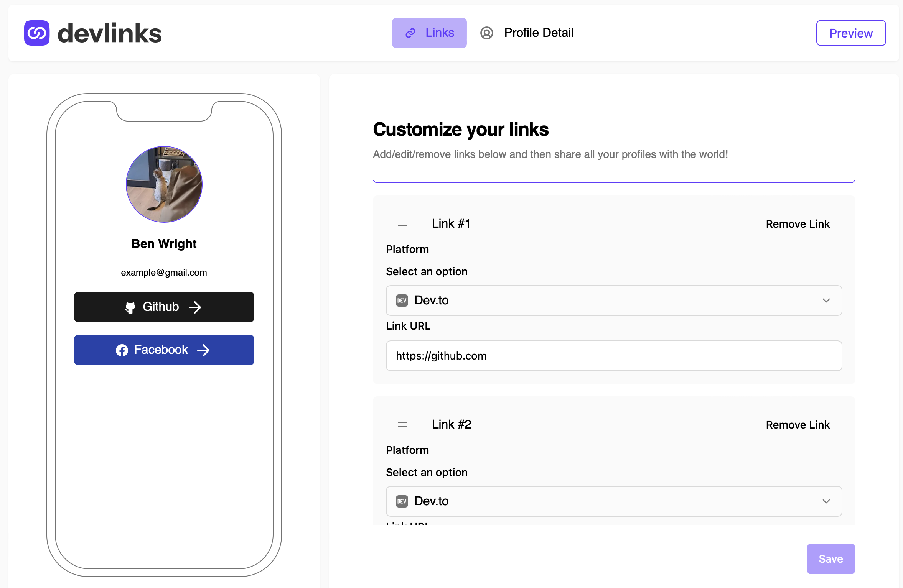
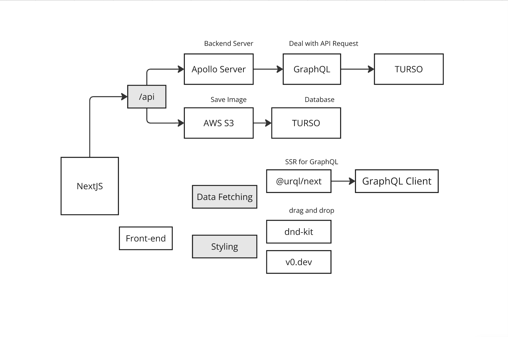

# Frontend Mentor - Link-sharing app solution

This is a solution to the [Link-sharing app challenge on Frontend Mentor](https://www.frontendmentor.io/challenges/linksharing-app-Fbt7yweGsT). Frontend Mentor challenges help you improve your coding skills by building realistic projects.

## Table of contents

- [Overview](#overview)
  - [The challenge](#the-challenge)
  - [Screenshot](#screenshot)
  - [Links](#links)
- [My process](#my-process)
  - [Built with](#built-with)
  - [What I learned](#what-i-learned)
  - [Continued development](#continued-development)
  - [Useful resources](#useful-resources)
- [Author](#author)

## Overview

### The challenge

Users should be able to:

- Create, read, update, delete links and see previews in the mobile mockup
- Receive validations if the links form is submitted without a URL or with the wrong URL pattern for the platform
- Drag and drop links to reorder them
- Add profile details like profile picture, first name, last name, and email
- Receive validations if the profile details form is saved with no first or last name
- Preview their devlinks profile and copy the link to their clipboard
- View the optimal layout for the interface depending on their device's screen size
- See hover and focus states for all interactive elements on the page
- **Bonus**: Save details to a database (build the project as a full-stack app)
- **Bonus**: Create an account and log in (add user authentication to the full-stack app)

### Screenshot



### Links

- Solution URL: [https://github.com/Chious/link-sharing-app-v2](https://github.com/Chious/link-sharing-app-v2)
- Live Site URL: [https://link-sharing-app-v2.vercel.app](https://link-sharing-app-v2.vercel.app)

## My process

### Built with



1. Front-end

\*main

- [Next.JS](https://nextjs.org/)
- [Tailwind CSS](https://tailwindcss.com/)
- [Typescript](https://www.typescriptlang.org/)

\*others

- [dnd-kit](https://dndkit.com) - package to manage drag and drop
- [@urql/next](https://www.npmjs.com/package/@urql/next) - package to manage graphql to nextjs in client side
- [sweetalert2](https://sweetalert2.github.io/) - package to manage alert

2. DB / Server

\*main

- [Next.JS](https://nextjs.org/) - build with api router and server action
- [TURSO](https://turso.tech) - sqlite database
- [drizzle-orm](https://orm.drizzle.team) - package to manage sql to turso
- [GraphQL](https://graphql.org/) - package to manage api
- [Amazon S3](https://aws.amazon.com/s3/) - package to save image in amazon

\*others

- [jsonwebtoken](https://www.npmjs.com/package/jsonwebtoken) - package to manage jwt
- [bycryptjs](https://www.npmjs.com/package/bcryptjs) - package to manage password

### Process:

1. 【FE】 Create Pages and setting styles for front-end:

- setting `tailwind.config.ts`
- create components (form/ dropdown/ etc)
- create pages (login/ register/ profile/ etc)
- build up drop and drag component with `dnd-kit`

2. 【BE】 Create GraphQL schema and mutation for backend:

- create `/api/graphql/schema.ts`
- create `/api/graphql/mutation.ts`
- create `/api/graphql/resolver.ts` -- connect graphql to Apollo Server
- 【FE】setup client side `@urql/next`

3. 【BE】 Create schema for database and connect to TURSO with `dirzzle-orm`:
   > Detail to the topic: https://orm.drizzle.team/learn/tutorials/drizzle-with-turso

- create `/api/db/index.ts`
- create `/api/db/schema.ts`

then run:

```
npm run db:gen
npm run db:push
```

4. 【FE】 Finish register and login & CRUD for profile

   > the process is using `useQuery` and `useMutation` from `@urql/next`

5. 【BE】 Upload image to S3 and save to database
   > the process is using `aws-sdk` to upload image to S3
   > Since form-data is restricted by GraphQL, create API route by nextjs instead.

- Setup User in S3, reference: https://conermurphy.com/blog/presigned-urls-nextjs-s3-upload

### What I learned

- CRUD with GraphQL in Server Side and Client Side
- Build up SQLite with `drizzle-orm`
- Image Upload with `aws-sdk`
- Presigned URL with `aws-sdk`
- Drag and Drop with `dnd-kit`

### Continued development

### Useful resources

1. [【Youtube】Storing Images in S3 from Node Server](https://www.youtube.com/watch?v=eQAIojcArRY)
2. [【Frontend Master】Server-Side GraphQL in Next.js](https://frontendmasters.com/courses/server-graphql-nextjs/)
3. [【DOC】drizzle-orm](https://orm.drizzle.team)
4. [【DOC】dnd-kit](https://dndkit.com)
5. [【DOC】@urql/next](https://www.npmjs.com/package/@urql/next)

## Author

- Github - [@Chious](https://github.com/Chious)
- Frontend Mentor - [@Chious](https://www.frontendmentor.io/profile/Chious)
